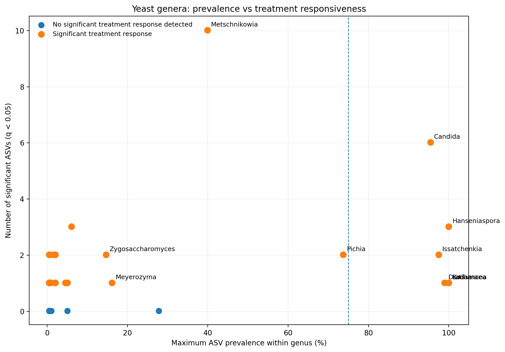
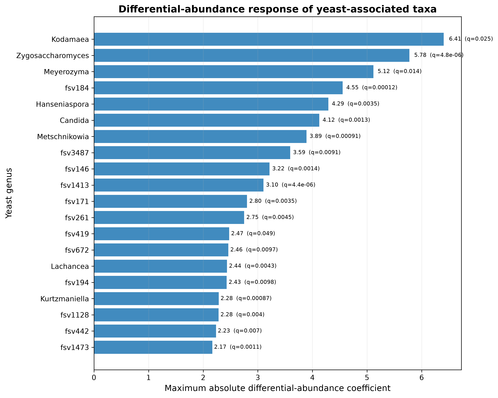

# Honey Bee Hindgut Yeast Microbiome

Reproducible bioinformatics and microbial-ecology analysis of yeast-associated fungi in the honey bee (*Apis mellifera*) hindgut microbiome.

## Project overview

This project analyzes publicly available ITS amplicon sequencing data from a longitudinal study of the *Apis mellifera* hindgut microbiome.

The main focus is on yeast-associated fungal taxa and their prevalence, community dynamics, and treatment responsiveness following probiotic delivery.

## Research question

How does probiotic delivery method influence the prevalence and treatment responsiveness of yeast-associated fungal taxa in the honey bee hindgut microbiome?

## Dataset

The analysis is based on publicly available sequencing data from:

- **Study:** Daisley et al., *The ISME Journal* (2023)
- **Article:** "Delivery mechanism can enhance probiotic activity against honey bee pathogens"
- **BioProject:** PRJNA856341
- **Sequencing platform:** Illumina MiSeq
- **Sequencing type:** paired-end ITS amplicon sequencing
- **Public SRA records:** 198 runs

The original study reported 3,387 fungal ASVs after DADA2 processing.

### Data sources

- SRA / BioProject: PRJNA856341
- Original study: Daisley et al., 2023
- Original authors' code and supplementary data are used where appropriate.

## Experimental design

The longitudinal experiment contains five treatment groups:

| Group | Description |
|---|---|
| NTC | No treatment control |
| PP | Patty + LX3 |
| PV | Patty vehicle |
| SP | Spray + LX3 |
| SV | Spray vehicle |

Sampling timepoints:

**W0, W2, W4, W8, W12, W24**

## Bioinformatics workflow

The repository documents a reproducible analysis workflow including:

1. Raw-read quality assessment
2. ITS primer identification
3. FASTQ handling
4. DADA2 workflow design
5. ASV-level fungal profiling
6. Taxonomic filtering
7. Yeast-associated ASV identification
8. Prevalence analysis
9. Differential-abundance result extraction
10. Fungal alpha-diversity visualization
11. Community-level variation analysis
12. Automated figure generation

## Quality control

A representative SRA run, **SRR20011368**, was independently inspected.

The run contained approximately:

- 39,478 paired spots
- R1 median length: ~243 bp
- R2 median length: ~244 bp
- Mean Phred quality: ~29.85 for R1
- Mean Phred quality: ~29.08 for R2

The raw-read quality profile is available in:

`figures/SRR20011368_quality_profile.png`

## Primer identification

The ITS1/ITS2 biological primer regions were inspected in the representative raw reads.

Approximate biological primer sequences detected were:

- Forward ITS1: `GGCTTGGT CATTTAGAGGAAGTAA`
- Reverse ITS2: `CGGCTGCGTTCTTCATCGATGC`

The complete constructs and associated barcode/adapter sequences are documented separately in the supplementary data.

## Yeast-associated taxa

From the supplementary ASV table, **221 ASVs** were classified within *Saccharomycetes*.

Using a prevalence threshold of **≥75%**, the analysis identified **15 highly prevalent yeast-associated ASVs**.

Examples include taxa assigned to:

- *Hanseniaspora*
- *Lachancea*
- *Kodamaea*
- *Candida*
- *Metschnikowia*
- *Zygosaccharomyces*
- *Issatchenkia*

The prevalence results are provided in:

`results/core_yeast_ASVs_75pct.csv`

## Treatment responsiveness

Treatment-specific differential-abundance results were examined using a false-discovery threshold of:

**q < 0.05**

The analysis identifies yeast-associated taxa showing differential abundance across treatment/timepoint comparisons.

Examples include:

- *Zygosaccharomyces*
- *Metschnikowia*
- *Candida*
- *Hanseniaspora*
- *Kodamaea*
- *Kurtzmaniella*
- *Lachancea*

The extracted differential-abundance summary is available in:

`results/yeast_treatment_DA_summary_q05.csv`

## Key visualizations

### Yeast prevalence versus treatment responsiveness



This visualization highlights highly prevalent yeast-associated taxa and the number of significant ASV-level treatment comparisons associated with each genus.

### Differential-abundance response



This figure summarizes the maximum absolute differential-abundance coefficient observed for yeast-associated taxa with statistically significant treatment responses.

## Community-level analyses

Additional analyses include:

- Observed fungal ASV richness
- Chao1 richness
- Shannon alpha diversity
- PERMANOVA-based community variation
- Yeast prevalence
- Differential-abundance analysis

Figures are available in the `figures/` directory.

## Important methodological note

This repository distinguishes between independently performed analyses and results extracted from the original study.

The representative raw-read QC and primer inspection were independently performed for **SRR20011368**.

The prevalence and differential-abundance analyses were independently extracted/reanalyzed from the authors' supplementary ASV and statistical tables.

The repository includes an R workflow for reproducing the DADA2 analysis:

`scripts/02_dada2_ITS.R`

However, a complete independent regeneration of the original 198-sample ASV table should not be claimed until the exact original processing parameters and merge strategy have been reproduced and validated.

## Reproducibility

The repository is organized to support reproducible research.

### Software

- R
- Bioconductor
- DADA2
- Python
- pandas
- NumPy
- Matplotlib

Dependencies are documented in:

- `requirements.txt`
- `R_packages.txt`

### Automated figure generation

Figure generation is automated through **GitHub Actions**.

The workflow executes:

`scripts/04_generate_yeast_figures.py`

and generates the yeast-response visualizations from the repository data.

## Repository structure

```text
honey-bee-yeast-microbiome/
├── data/
│   ├── metadata/
│   └── supplementary_results/
├── docs/
├── figures/
├── results/
├── scripts/
│   ├── 01_raw_qc_notes.md
│   ├── 02_dada2_ITS.R
│   ├── 03_yeast_prevalence_analysis.py
│   └── 04_generate_yeast_figures.py
├── CITATION.cff
├── LICENSE
├── README.md
├── R_packages.txt
└── requirements.txt
